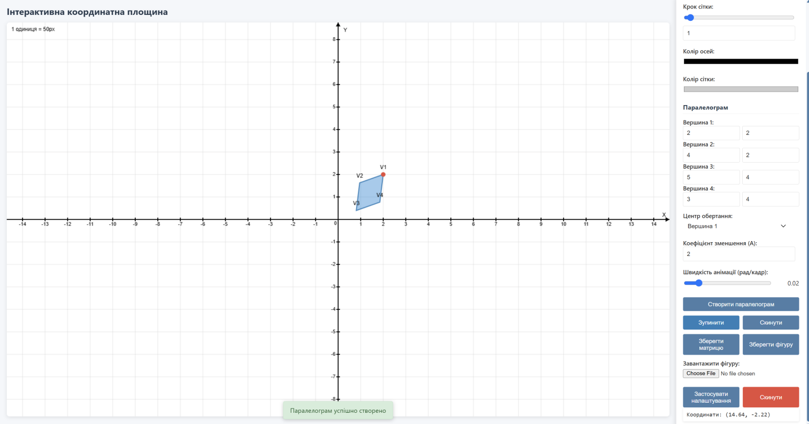
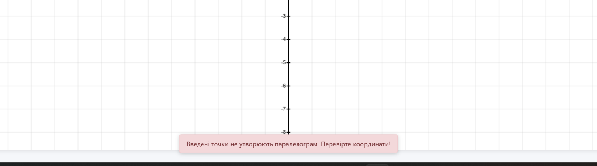

# 📐 Interactive Coordinate Plane with Parallelogram Animation

A web application for visualizing and animating geometric transformations of parallelograms on a coordinate plane using affine transformation matrices.

## ✨ Features

- **Interactive Coordinate Plane** with customizable grid and scaling
- **Parallelogram Creation** from vertex coordinates with automatic validation
- **Rotation and Scaling Animation** around a selected vertex
- **Mathematically Precise Transformations** using affine transformation matrices
- **Data Export** - save transformation matrices and shape coordinates
- **Configuration Import** - load saved parallelograms
- **Dark/Light Theme** for comfortable work
- **Real-time Mouse Coordinate Tracking**

## 🖼️ Screenshots
<p align="center">
  
</p>
<p align="center">
  
</p>
## 🚀 Quick Start

### Installation

```bash
# Clone the repository
git clone https://github.com/kateryna-havryshchuk/parallelogram-animation.git

# Navigate to project directory
```

### Running

Simply open `index.html` in a web browser, or use a local server:

## 📚 Usage

### Creating a Parallelogram

1. Enter coordinates for four vertices in the control panel
2. Click the **"Create Parallelogram"** button
3. The system will automatically verify if the points form a valid parallelogram

### Animation Settings

- **Rotation Center**: select the vertex around which rotation will occur
- **Scale Factor (A)**: set a value from -1000 to 1000
  - A > 1: shape shrinks
  - A = 1: no scaling
  - 0 < A < 1: shape grows
- **Animation Speed**: adjust rotation speed (0.01 - 0.1 rad/frame)

### Animation Controls

- **Start Movement** - begin animation
- **Stop** - pause animation
- **Reset** - return to initial state

### Coordinate Plane Settings

- **Unit Length**: change scale from 20 to 100 pixels
- **Grid Step**: set distance between grid lines (1-5 units)
- **Colors**: customize axis and grid colors
- **Mouse Wheel Zoom**: scroll to change scale

### Data Export and Import

#### Save Transformation Matrix
Click **"Save Matrix"** to export a JSON file containing:
- Affine transformation matrix (3×3)
- Rotation parameters (in radians and degrees)
- Scaling coefficient
- Rotation center coordinates
- Initial and current vertex coordinates

#### Save Shape
Click **"Save Shape"** to export the parallelogram configuration

#### Load Shape
Use the **"Load Shape"** field to import saved configurations

## 🧮 Mathematical Foundation

### Affine Transformation Matrix

The program uses 3×3 matrices for affine transformations in homogeneous coordinates:

```
⎡ s·cos(θ)  -s·sin(θ)  tx ⎤
⎢ s·sin(θ)   s·cos(θ)  ty ⎥
⎣    0          0       1  ⎦
```

where:
- **s** - scaling coefficient (depends on time and parameter A)
- **θ** - rotation angle
- **tx, ty** - translation components for rotation around a given point

### Animation Algorithm

The animation consists of two phases:

**Phase 1** (0° → 180°):
- Clockwise rotation
- Shrinking from original size to size/A

**Phase 2** (180° → 360°):
- Counter-clockwise rotation
- Growing from size/A back to original size

The scaling coefficient is calculated as:
```javascript
// First half (0 ≤ t < 0.5)
s = 1 - 2t × (1 - 1/A)

// Second half (0.5 ≤ t ≤ 1)
s = 1/A + 2(t - 0.5) × (1 - 1/A)
```

## 🛠️ Technologies

- **HTML5 Canvas** - for drawing coordinate plane and shapes
- **Vanilla JavaScript** - application logic without dependencies
- **CSS3** - modern design with theme support
- **JSON** - format for data export/import


## 🎯 Usage Examples

### Example 1: Square
```json
{
  "vertices": [
    {"x": 2, "y": 2},
    {"x": 4, "y": 2},
    {"x": 4, "y": 4},
    {"x": 2, "y": 4}
  ],
  "pivotVertexIndex": 0,
  "scaleFactorA": 2
}
```

### Example 2: Rectangle
```json
{
  "vertices": [
    {"x": 1, "y": 1},
    {"x": 5, "y": 1},
    {"x": 5, "y": 3},
    {"x": 1, "y": 3}
  ],
  "pivotVertexIndex": 2,
  "scaleFactorA": 3
}
```

## 🔍 Implementation Features

- **Parallelogram Validation**: automatic verification of opposite sides parallelism
- **Smooth Animation**: using `requestAnimationFrame` for 60 FPS
- **Responsive Design**: automatic adjustment to window size
- **Mathematical Precision**: floating-point calculations with 4-digit accuracy
- **Zero External Dependencies**: pure JavaScript without libraries

## 👨‍💻 Author

Kateryna Havryshchuk

⭐️ If you found this project useful, please give it a star on GitHub!
